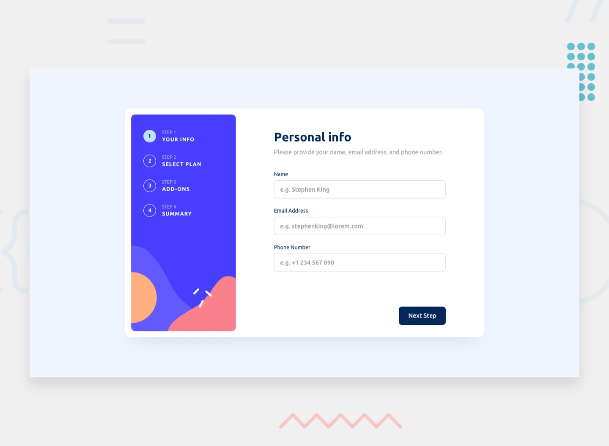

# Multi-Step Form



## Table of Contents

- [Overview](#overview)
- [Features](#features)
- [Screenshots](#screenshots)
- [Getting Started](#getting-started)
- [Built With](#built-with)
- [Folder Structure](#folder-structure)
- [Style Guide](#style-guide)
- [Acknowledgements](#acknowledgements)
- [Contact](#contact)

---

## Overview

This project is a solution to the [Frontend Mentor Multi-step form challenge](https://www.frontendmentor.io/challenges/multistep-form-YVAnSdqQBJ). The goal is to build a fully functional and responsive multi-step form, closely matching the provided design. Users can fill out multiple steps, review their information, and receive validation feedback throughout the process.

## Features

- Complete each step of a multi-step form sequence
- Navigate back and forth between steps to update selections
- Live summary and confirmation of selections on the final step
- Responsive layout for all device sizes (mobile, tablet, desktop)
- Interactive UI with hover and focus states for all elements
- Form validation with messages for:
  - Missing required fields
  - Incorrect email formatting
  - Submitting a step with no selection

---

## Screenshots

| Mobile Design | Desktop Design |
| :-----------: | :------------: |
|  |  |

> More design references can be found in the `/design` folder.

---

## Getting Started

### Prerequisites

- Basic knowledge of HTML, CSS, and JavaScript
- [Node.js](https://nodejs.org/) and [npm](https://www.npmjs.com/) (optional, if using build tools)

### Installation

1. Clone the repository:
   ```bash
   git clone https://github.com/MohamedTel18/Collection.git
   ```
2. Navigate to the folder:
   ```bash
   cd Collection/13
   ```
3. Open `index.html` in your web browser.

*Optional: Install dependencies and run local server if using a framework or build tools.*

---

## Built With

- HTML5
- CSS3 / SCSS
- JavaScript (Vanilla or your preferred framework)
- [Frontend Mentor](https://www.frontendmentor.io/) assets and design

---

## Folder Structure

```
13/
├── assets/         # Optimized images and fonts
├── design/         # JPG files for mobile & desktop designs
├── style-guide.md  # Colors, fonts, and UI guidelines
├── README.md
├── README-template.md
├── index.html
├── ...
```

---

## Style Guide

For colors, fonts, and other design details, refer to the [`style-guide.md`](./style-guide.md) file provided in this project.

---

## Acknowledgements

- Challenge by [Frontend Mentor](https://www.frontendmentor.io/).
- Design assets and instructions from the challenge repository.

---

## Contact

- [Frontend Mentor Profile](https://www.frontendmentor.io/profile/MohamedTel18)
- Email: [your-email@example.com](mailto:your-email@example.com)

---

### Built with ❤️ as part of Frontend Mentor challenges
